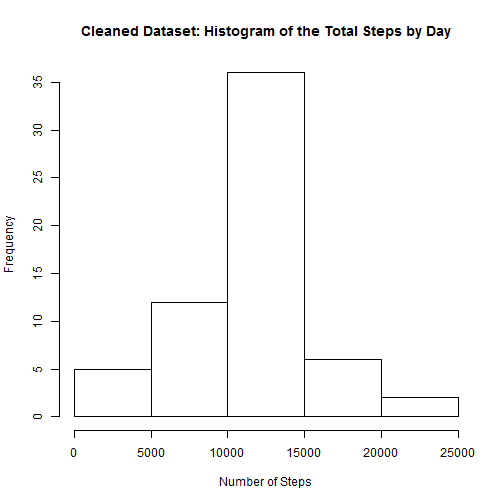

## Loading and preprocessing the data

```r
library(dplyr)
```

```
## Warning: package 'dplyr' was built under R version 3.1.2
```

```
## 
## Attaching package: 'dplyr'
## 
## The following object is masked from 'package:stats':
## 
##     filter
## 
## The following objects are masked from 'package:base':
## 
##     intersect, setdiff, setequal, union
```

```r
stepsDF <- read.csv("activity.csv")
```


## What is mean total number of steps taken per day?  

**For this part of the assignment, you can ignore the missing values in the dataset.**  
**1. Calculate the total number of steps taken per day**  


```r
#using dplyr, summarize data by date
dateSum <- stepsDF %>%
  group_by(date) %>%
  summarize(TotalSteps = sum(steps))
```


**2. Make a histogram of the total number of steps taken each day**  

```r
hist(dateSum$TotalSteps, main = "Histogram of the Total Steps by Day", xlab = "Number of Steps")
```

 

    
**3. Calculate and report the mean and median of the total number of steps taken per day**  
The mean number of steps is:

```r
meanSteps <- mean(dateSum$TotalSteps, na.rm = TRUE)
meanSteps
```

```
## [1] 10766.19
```

The median number of steps is:

```r
medianSteps <- median(dateSum$TotalSteps, na.rm = TRUE)
medianSteps
```

```
## [1] 10765
```


## What is the average daily activity pattern?

**1.Make a time series plot (i.e. type = "l") of the 5-minute interval (x-axis) and the average number of steps taken, averaged across all days (y-axis)**  


```r
#average the number of steps taken by interval: 0, 5, 10, etc...
#plot this as a time series
intervalMean <- stepsDF %>%
  group_by(interval) %>%
  summarize(avgSteps = mean(steps, na.rm = TRUE))

plot(intervalMean$interval, intervalMean$avgSteps, type = "l", xlab = "Time Interval", ylab = "Average Steps")
```

 

**2.Which 5-minute interval, on average across all the days in the dataset, contains the maximum number of steps?**    


```r
#using the dplyr arrange function, find out which 5 minute interval has the most number of steps
arrange(intervalMean, desc(avgSteps))
```

```
## Source: local data frame [288 x 2]
## 
##    interval avgSteps
## 1       835 206.1698
## 2       840 195.9245
## 3       850 183.3962
## 4       845 179.5660
## 5       830 177.3019
## 6       820 171.1509
## 7       855 167.0189
## 8       815 157.5283
## 9       825 155.3962
## 10      900 143.4528
## ..      ...      ...
```

**Conclusion**: time interval 835 has the most average number of steps


## Imputing missing values

**1. Calculate and report the total number of missing values in the dataset (i.e. the total number of rows with NAs)**  


```r
sum(is.na(stepsDF$steps))
```

```
## [1] 2304
```

**Conclusion**: the number of missing values is 2304  


**2. Devise a strategy for filling in all of the missing values in the dataset. The strategy does not need to be sophisticated. For example, you could use the mean/median for that day, or the mean for that 5-minute interval, etc.**  


**3. Create a new dataset that is equal to the original dataset but with the missing data filled in.**  

**Implementation of the answer to questions 2 and 3 in code:**    


```r
##################################################
#   input missing values
#DEVISE A STRATEGY FOR FILLING IN NA VALUES
#ALGORITHM:
#1. Read in the data set into a new data frame
#2. Loop through the dataset using a traditional loop structure
#3. If an NA is found, replace it with the average from intervalMean
#Justification:
# the activity in each daily 5 minute interval is likely to be the same
# so replace missing activity (steps) with the mean from that 5 minute interval

#create the second dataset
stepsDFclean <- read.csv("activity.csv")

#create a for loop based on the size of the dataset
seq <- seq_len(nrow(stepsDFclean))

for (i in seq) {
  if (is.na(stepsDFclean[i,]$steps)) {
    #NA is found, replace it with the average from intervalMean
    currInt <- stepsDFclean[i,]$interval
    avgSteps <- intervalMean[intervalMean$interval == currInt,]$avgSteps
    stepsDFclean[i,]$steps <- avgSteps
  }
  
}
```


**4. Make a histogram of the total number of steps taken each day and Calculate and report the mean and median total number of steps taken per day.**      


```r
#create a histogram of the total number of steps taken each day with the revised data
#using dplyr, summarize data by date
#summarize the data by year
dateSumClean <- stepsDFclean %>%
  group_by(date) %>%
  summarize(TotalSteps = sum(steps))

#histogram of the total number of steps
hist(dateSumClean$TotalSteps, main = "Cleaned Dataset: Histogram of the Total Steps by Day", xlab = "Number of Steps")
```

 

```r
#mean of the total steps per day
mean(dateSumClean$TotalSteps)
```

```
## [1] 10766.19
```

```r
#median of the total steps per day
median(dateSumClean$TotalSteps)
```

```
## [1] 10766.19
```


**Do these values differ from the estimates from the first part of the assignment? What is the impact of imputing missing data on the estimates of the total daily number of steps?**   

**Commentary**: The values do differ slightly from the estimates in the first part of the assignment, however, by imputing the missing data
as I did, using the mean of each 5 minute interval, had the effect of bringing the mean and median closer together. This is to be expected since
more values at the average(mean) were added to the dataset.    


## Are there differences in activity patterns between weekdays and weekends?


**For this part the weekdays() function may be of some help here. Use the dataset with the filled-in missing values for this part. 

** 1. Create a new factor variable in the dataset with two levels - "weekday" and "weekend" indicating whether a given date is a weekday or weekend day.**  


```r
##Are there differences in activity patterns between weekdays and weekends? 

##day of week function
##given a date, return "weekend" if it is a Saturday or Sunday
##else return "weekday"
calcWeekend <- function(date) {
  if (weekdays(as.Date(date)) %in% c("Saturday", "Sunday")){ 
    "weekend"
  } else { 
    "weekday"
  }
}

stepsDFclean$isWeekend <- as.factor(sapply(stepsDFclean$date, calcWeekend))
```
    
** 2. Make a panel plot containing a time series plot (i.e. type = "l") of the 5-minute interval (x-axis) and the average number of steps taken, averaged across all weekday days or weekend days (y-axis). See the README file in the GitHub repository to see an example of what this plot should look like using simulated data. **   


```r
#separate the weekend and weekdays into different datasets
weekendSteps <- subset(stepsDFclean, isWeekend == "weekend")
weekdaySteps <- subset(stepsDFclean, isWeekend == "weekday")

#using dplyr, calculate the mean of steps for each time interval over the weekend and week days
weekendMean <- weekendSteps %>%
  group_by(interval) %>%
  summarize(meanSteps = mean(steps))

weekdayMean <- weekdaySteps %>%
  group_by(interval) %>%
  summarize(meanSteps = mean(steps))


par(mfcol = c(2,1))
plot(weekendMean$interval, weekendMean$meanSteps, type="l", bg = "white", ylab="Mean Steps", xlab= "Interval", main = "Mean Weekend Steps by Interval")
plot(weekdayMean$interval, weekdayMean$meanSteps, type="l", bg = "white", ylab="Mean Steps", xlab= "Interval", main = "Mean Week Day Steps by Interval")
```

 


